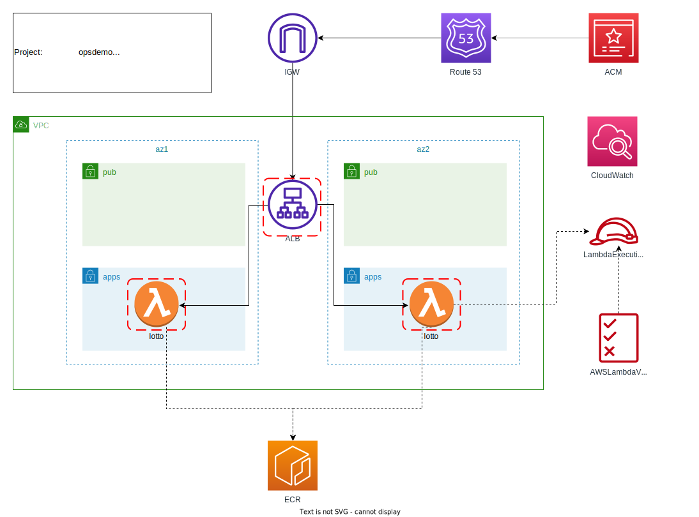

# aws-alb-lambda-rest

이 프로젝트는 Terraform 을 사용하여 AWS 의 대표적인 서버리스 서비스인 Lambda 와 여기에 관련된 AWS 리소스를 한번에 프로비저닝하는 데모 입니다.

샘플 애플리케이션은 1 에서 45 까지의 숫자 중 6자리 숫자를 랜덤으로 추천하는 로또 번호 추천 서비스 입니다. 

## Architecture
 


### 주요 리소스 개요
- Route 53: 인터넷 사용자가 도메인 이름을 통해 서비스에 접근 합니다.
- VPC: 컴퓨팅 리소스를 배치하는 공간으로 네트워크 구성 및 네트워크 연결 리소스로 서로 통합 되어 있습니다.
- ALB: Route 53 으로부터 유입되는 트래픽을 요청에 대응하는 Lambda 애플리케이션 서비스로 라우팅 합니다.
- ECR: lambda-rest 컨테이너 (도커) 이미지를 등록 관리하는 이미지 저장소 입니다.
- Lambda: lambda-rest 애플리케이션 서비스 입니다.
- CloudWatch LogGroup: Lambda 애플리케이션 서비스의 로그를 수집합니다.
- IAM Role: Lambda 배치 및 실행을 위한 롤 및 정책이 구성 됩니다.

<br>

## Pre-requisite

AWS Lambda 서버리스 컴퓨팅 서비스를 프로비저닝 하기 위해 다음의 Tool 들을 설치 해야 합니다.
- [Terraform 설치](https://learn.hashicorp.com/tutorials/terraform/install-cli)
- [AWS CLI 설치](https://docs.aws.amazon.com/ko_kr/cli/latest/userguide/getting-started-install.html)
- [AWS Profile 구성](https://docs.aws.amazon.com/ko_kr/cli/latest/userguide/cli-configure-files.html)
- [Docker 설치](https://docs.docker.com/desktop/mac/install/)

- 특히, Domain 서비스가 사전에 구성 되어 있어야 하며, Docker 이미지를 빌드 할 수 있도록 Docker Daemon 이 구동되어 있어야 합니다.
  아래 `docker images` 명령을 통해 아래와 같이 정상 동적 여부를 확인 하세요.  
  

- [AWS CLI 설치](https://docs.aws.amazon.com/ko_kr/cli/latest/userguide/install-cliv2.html) 가이드를 참고하여 구성해 주세요.

- [AWS Confiugre](https://docs.aws.amazon.com/cli/latest/userguide/cli-configure-quickstart.html) 가이드를 참고하여 프로파일을 설정 합니다.  
  `aws configure --profile produser` 명령 참고

- 인터넷 서비스를 위한 도메인을 발급 받고 Route 53 의 Public Host Zone 을 사전에 구성해 주세요.  
  [도메인 발급 및 Route53 구성](https://symplesims.github.io/devops/route53/acm/hosting/2022/01/11/aws-route53.html) 을 참고 하여 무료 도메인을 한시적으로 활용할 수 있습니다.

- Git, Terraform, AWS-CLI, NodeJS 등 주요 프로그램을 로컬 환경(PC) 에 설치 및 설정 하세요.  
  [Mac OS 개발자를 위한 로컬 개발 환경 구성](https://symplesims.github.io/development/setup/macos/2021/12/02/setup-development-environment-on-macos.html) 을 참고 하여 필요한 프로그램을 구성할 수 있습니다.

<br>

## Git
```
git clone https://github.com/chiwoo-cloud-native/aws-alb-lambda-rest.git

# 프로젝트 기준 경로로 이동하세요.
cd aws-alb-lambda-rest
```

<br>

## Build
Terraform 모듈을 통해 AWS 클라우드 리소스를 한번에 구성 합니다.

서비스 구성을 위한 [terraform.tfvars](./terraform.tfvars) 테라폼 변수는 본인의 환경에 맞게 구성 하세요.

```
terraform -chdir=vpc init && terraform -chdir=alb init && terraform -chdir=helloworld init && \
terraform -chdir=vpc apply -var-file=../terraform.tfvars -auto-approve && \
terraform -chdir=alb apply -var-file=../terraform.tfvars -auto-approve && \
terraform -chdir=helloworld apply -var-file=../terraform.tfvars -auto-approve
```

<br>

## Check

cURL 명령을 통해 lotto 서비스가 정상인지 확인해 봅니다.

```
curl -v -XGET https://lotto.sympleops.ml/ 
```

<br>


## Destroy

helloworld 서비스와 관련된 모든 AWS 리소스를 한번에 제거 합니다.

경우에 따라서 Security-Group 이 제거되기까지 30분 정도 소요 될 수 있습니다.

```
terraform -chdir=helloworld destroy -var-file=../terraform.tfvars -auto-approve && \
terraform -chdir=alb destroy -var-file=../terraform.tfvars -auto-approve && \
terraform -chdir=vpc destroy -var-file=../terraform.tfvars -auto-approve
```
